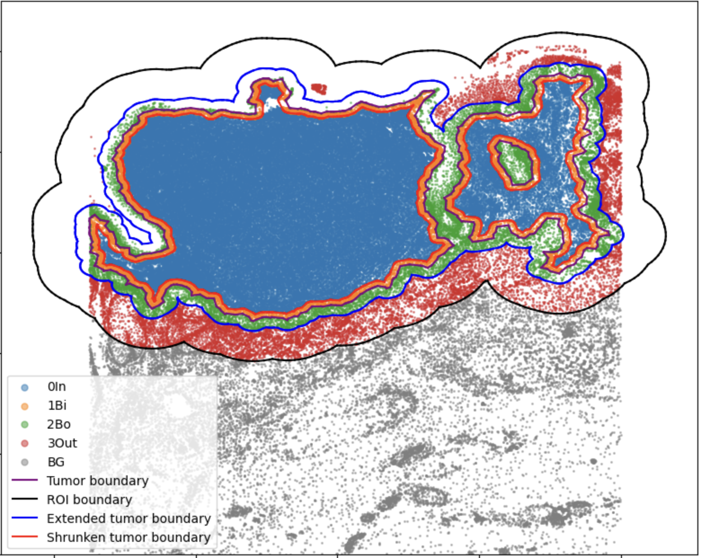

# SpatialCells: Spatial Analysis for Single-Cell Data

This package aims to develop computational methods for region-based analyses of multiplexed single-cell data.

## Run the code
Download the code      
Run `pip install .`      
See `examples/0_example_basic.ipynb` for basic use case    

## Contact
Please contact guihong.wan@outlook.com in case you have any questions.
